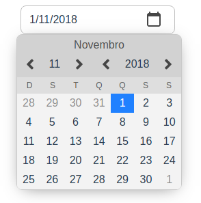

# VDateSelector
Simple Date Picker/Date Selector/Calendar in Vue

[


](https://www.npmjs.com/package/v-date-selector)
[](https://vuejs.org/)



## Table of contents
- [Installation](#installation)
- [Usage](#usage)
- [Demo](#demo)

# Installation
```bash
yarn add v-date-selector
```
# Usage
```vue
<template>
  <div id="app">
    <VDateSelector v-model="date"/>
  </div>
</template>

<script>
import VDateSelector from 'v-date-selector'

export default {
  name: 'app',
  components: {
    VDateSelector
  },
  data: () => ({
    date: new Date('1/1/2019')
  }),
  mounted() {
    console.log(VDateSelector)
  }
}
</script>
```

# Demo
<!-- Click here to view in Browser: [Vue Component (Multi Select/Double Select)]() -->
